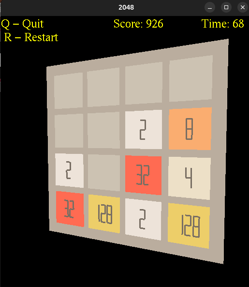

# 3D 2048 Game

A simple 3D implementation of the popular 2048 puzzle game built with C++ and OpenGL. This version features a game board with interactive camera controls and custom number rendering.

## Features

- **3D Visualization**: Experience the classic 2048 game in a 3D environment
- **Interactive Camera**: Mouse-controlled rotation and zoom functionality
- **Custom Number Display**: Numbers are rendered using line segments for a unique visual style
- **Real-time Score Tracking**: Display current score and elapsed time
- **Game State Management**: Win/lose detection with visual feedback
- **Keyboard Controls**: Standard WASD movement with additional shortcuts

## Screenshot



## Requirements

- **Compiler**: g++ (C++11 or later)
- **Graphics Libraries**:
  - OpenGL
  - GLUT (OpenGL Utility Toolkit)
  - GLU (OpenGL Utility Library)

### Linux Installation
```bash
# Ubuntu/Debian
sudo apt-get install build-essential libgl1-mesa-dev libglu1-mesa-dev freeglut3-dev

# Fedora/RHEL
sudo dnf install gcc-c++ mesa-libGL-devel mesa-libGLU-devel freeglut-devel
```

### macOS Installation
```bash
brew install freeglut
```

## Building the Game

1. **Clone or download the project files**

2. **Navigate to the project directory**
   ```bash
   cd 2048-3d
   ```

3. **Build using Make**
   ```bash
   make
   ```

4. **Run the game**
   ```bash
   ./2048
   ```

## Controls

### Game Movement
- **W** / **↑** - Move tiles up
- **A** / **←** - Move tiles left  
- **S** / **↓** - Move tiles down
- **D** / **→** - Move tiles right

### Camera Controls
- **Mouse Drag** - Rotate the 3D view
- **Mouse Wheel** / **Arrow Keys** - Zoom in/out
- **Scroll Up/Down** - Adjust camera distance

### Game Controls
- **R** - Restart the game
- **Q** - Quit the application

## Game Rules

1. **Objective**: Combine tiles with the same number to reach 2048
2. **Movement**: Use WASD keys to slide tiles in four directions
3. **Combining**: When two tiles with the same number touch, they merge into one
4. **New Tiles**: After each move, a new tile (2 or 4) appears randomly
5. **Winning**: Reach the 2048 tile to win
6. **Losing**: Game ends when no more moves are possible

## Project Structure

```
2048-3d/
├── Makefile           # Build configuration
├── src/              # Source files
│   ├── main.cpp      # Application entry point
│   ├── Scene.cpp     # Main game scene management
│   ├── Board.cpp     # Game board logic
│   ├── Cell.cpp      # Individual tile rendering
│   ├── DinamicText.cpp    # Dynamic text display
│   ├── StaticText.cpp     # Static text display  
│   ├── Text.cpp      # Base text class
│   └── utils.cpp     # Utility functions and colors
├── inc/              # Header files
│   ├── Scene.h
│   ├── Board.h
│   ├── Cell.h
│   ├── DinamicText.h
│   ├── StaticText.h
│   ├── Text.h
│   └── utils.h
└── obj/              # Object files (generated)
```

## Architecture

### Core Classes

- **Scene**: Manages the overall game state, user input, and rendering
- **Board**: Handles the 4x4 game grid and tile movement logic
- **Cell**: Represents individual tiles with 3D rendering and number display
- **Text Classes**: Handle UI text rendering (score, time, instructions)

### Key Features

- **3D Rendering**: Uses OpenGL to create a three-dimensional game board
- **Custom Number Display**: Numbers are drawn using line segments rather than fonts
- **Color Coding**: Each tile value has a unique color scheme
- **Animation**: Smooth transitions and visual feedback

## Technical Details

- **Graphics API**: OpenGL with GLUT for window management
- **Rendering**: Custom parallelepiped function for 3D tile rendering
- **Input Handling**: GLUT callback functions for keyboard and mouse events
- **Timer System**: Built-in game timer with second-by-second updates

## Building from Source

The project uses a standard Makefile with the following targets:

- `make` or `make all` - Build the executable
- `make clean` - Remove object files
- `make uninstall` - Remove executable and object files
- `make reinstall` - Clean rebuild

## Troubleshooting

### Common Issues

1. **Compilation Errors**: Ensure all required OpenGL libraries are installed
2. **Missing Headers**: Check that GLUT development packages are installed
3. **Linking Errors**: Verify that OpenGL libraries are properly linked

### Performance

- The game should run smoothly on most modern systems
- If experiencing lag, try reducing window size or adjusting camera distance

## Contributing

Feel free to submit issues and enhancement requests. The codebase is well-structured for extensions such as:

- Additional visual effects
- Sound integration  
- Different board sizes
- Enhanced animations
- Mobile touch controls

## License

This project is available for educational and personal use. Please respect the original 2048 game concept created by Gabriele Cirulli.

---

**Enjoy playing 3D 2048!** 🎮
